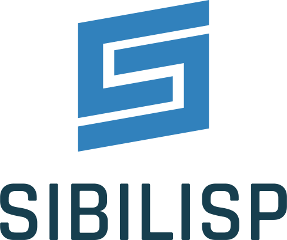

<br><br>

   

Sibilisp is a [Sibilant](https://sibilant.org/) based s-expression language that transpiles to JavaScript. It sees itself as a dialect of Sibilant and is usable with or without Sibilant.

Sibilisp extends Sibilant with ES2015+ features like `import` and `export` statements, `Generator`s or `Promise`s.

#### Key features
* Supports `.slisp`, `.sibilant` and `.js` files.
* Tail recursive programming via `loop` and `recur`
* ES2015+ based module system
* ES2015+ based generator functions and yielding
* Build-in facilities for creating tagged type constructors and sum types
* Results in readable JavaScript
* Tailored towards functional programming
* Leaves built-in types completely untouched

#### Main differences to Sibilant

* More (Common) Lisp oriented than pure Sibilant. This is resembled in the names of Sibilisp's macros. Sibilisp tends to be more verbose, but also more high-level than Sibilant.
* Ships with it's own utility toolbelt, a collection of functions and data structures inspired by following the [Fantasy-Land](https://github.com/fantasyland/fantasy-land) specification.
* Sibilisp changes some of Sibilant's macros to make the code _run faster_ or or _accept more types_.

#### Goal
Sibilisp should build upon the foundation that Sibilant provides and enriche it with a custom set of macros and utilities that make it easy to write correct programs.

#### Documentation

Sibilisp's main language layer is stable and unlikely to change. A reference sheet about it is in the [Wiki](https://github.com/urbandrone/sibilisp/wiki/02-Language). A tutorial about the [macro system](https://github.com/urbandrone/sibilisp/wiki/04-Macros) exists as well.

If you like, you can study [Sibilisp's macros file](https://github.com/urbandrone/sibilisp/blob/master/lang/macros.sibilant).

Haven't used Sibilant before? Check out the [Sibilant docs](https://docs.sibilant.org) to get an overview about Sibilisp's foundations.

### Install

You can install Sibilisp right from NPM:

```
$ npm i -D sibilisp
```

This installs the transpiler, the language layer and Sibilant.

### CLI Usage

After installation, the Sibilisp CLI accepts the following command.
The text in [BRACKETS] depends on the file structure of your project:

```
$ sibilisp --src [INPATH/DIR/] --dest [OUTPATH/DIR/]
```

Or shorter:

```
$ sibilisp -s [INPATH/DIR/] -d [OUTPATH/DIR/]
```

The CLI will transpile each `.slisp` and `.sibilant` file inside [INPATH/DIR/],
and will create a `.js` file with the same name inside [OUTPATH/DIR/]. You can then either ship the resulting JavaScript as modules or use a JavaScript bundler like [Rollup](https://rollupjs.org).

 Since version 0.6.6, the CLI allows to define the type of output file that is generated via the `--filetype` or `-f` argument. It accepts the values `js` (default value) or `mjs` and generates `.js` or `.mjs` files respectively.

```
$ sibilisp -s [INPATH/DIR/] -d [OUTPATH/DIR/] -f mjs
```